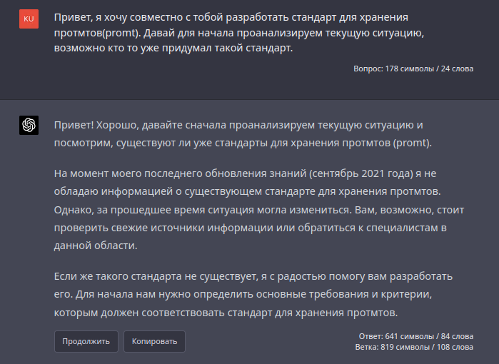
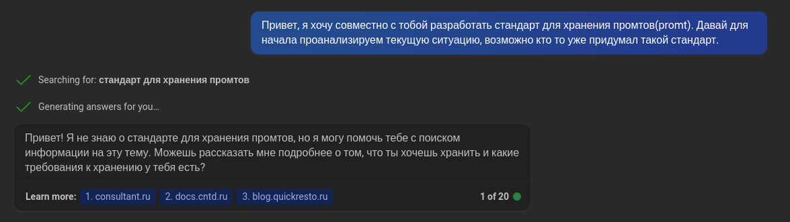

# promtstd

`promtstd` - это стандарт, разработанный с целью предоставить общепринятый и универсальный подход к хранению и использованию промтов в разработке искусственных интеллектов. Он облегчает взаимодействие разработчиков, повышает качество создаваемых AI и уменьшает трудозатраты на поддержку системы промтов.

[](https://github.com/denisxab/promtstd)

Основываясь на простоте и доступности `Markdown`, `promtstd` предлагает структурированный и удобочитаемый синтаксис для хранения промтов. Это позволяет разработчикам легко создавать, обновлять и делиться промтами, а также оценивать их качество и эффективность.

Применение стандарта `promtstd` в проектах искусственного интеллекта обеспечивает упорядоченность кодовой базы, что значительно снижает вероятность ошибок, затруднений и проблем при дальнейшей разработке и поддержке AI. В целом, использование `promtstd` призвано способствовать успешному развитию AI-технологий и улучшению пользовательского опыта.

## Важность стандарта

В современной разработке AI промты играют важную роль, так как они определяют, как будет взаимодействовать AI с пользователем и какие задачи будет решать.

Однако на данный момент отсутствует унифицированный стандарт для хранения и использования промтов, что приводит к ряду проблем:

1. Затруднение взаимодействия разработчиков: без стандарта разработчики вынуждены использовать свои собственные конвенции и методы хранения промтов, что может усложнить коммуникацию и сотрудничество между разными командами.
2. Увеличение трудозатрат на создание и поддержку AI: из-за отсутствия стандарта разработчики тратят больше времени на разработку, поддержку и модификацию промтов, что снижает производительность и увеличивает затраты на проекты.
3. Снижение качества AI: без стандарта промты могут быть хранены и использованы неэффективно, что снижает общую эффективность AI и может привести к некорректному выполнению задач.
Создание стандарта для хранения и использования промтов может существенно улучшить эти аспекты и сделать разработку AI более удобной, эффективной и качественной.

- 
- 

## Основная концепция

Основная концепция стандарта `promtstd` заключается в предоставлении унифицированного подхода к хранению и использованию промтов с помощью популярного и легко читаемого формата `Markdown`. Это обеспечивает следующие преимущества:

1. Легкость чтения: промты, хранящиеся в формате `Markdown`, легко читаются и понимаются разработчиками, что упрощает работу с ними и снижает вероятность ошибок.
1. Расширяемость: стандарт `promtstd` позволяет легко добавлять новые элементы и разделы, что обеспечивает гибкость и адаптивность к различным сценариям использования промтов.
1. Удобство работы: использование стандарта `promtstd` упрощает процесс разработки, тестирования и поддержки промтов, так как все разработчики работают с одним и тем же форматом и структурой данных.

В целом, стандарт `promtstd` способствует улучшению качества разработки AI, упрощает коммуникацию между разработчиками и снижает затраты на создание и поддержку промтов. Внедрение и соблюдение данного стандарта помогут обеспечить более эффективное и качественное взаимодействие AI с пользователем, а также повысить стабильность и функциональность разрабатываемых AI-решений.

## Синтаксис хранения промта в PromtStd.Markdown

Промты хранятся в Markdown формате.

### Структура хранения промта

Учитывая, что промпты могут быть объемными и иметь множество особенностей, наиболее удобным решением является хранение их в отдельных файлах. Для структурирования промптов используется стандартное разделение по папкам:

```bash
КорневаяПапка_С_Промтами
│ 
├── Группа_1
│   ├── Файл_С_Промтом_1.md
│   ├── Файл_С_Промтом_1.json
│   ├── Файл_С_Промтом_2.md
│   ├── Файл_С_Промтом_2.json
│   └── Файл_С_Промтом_3.md
│   └── Файл_С_Промтом_3.json
└── Группа_2
    ├── Файл_С_Промтом_1.md
    ├── Файл_С_Промтом_1.json
    ├── Файл_С_Промтом_2.md
    ├── Файл_С_Промтом_2.json
    └── Файл_С_Промтом_3.md
    └── Файл_С_Промтом_3.json
```

Так как промпты могут быть объемными и иметь множество особенностей, мы решили не устанавливать строгие рамки для хранения промптов и вместо этого создать правила для структурирования заголовков, а также расширить возможности Markdown. Такой подход к стандарту предоставляет большой потенциал для хранения промптов в будущем.

1. Оформление заголовков с нужными именами и уровнем для файле `Файл_С_Промтом.md`

  ```md
  # meta
  # doc
  # base_promt
  # tools
  ## Название для вспомогательного промта 1
  ## Название для вспомогательного промта ...
  # expl
  ## Название для примера запроса 1
  ### Название для примера ответа 1 
  ### Название для примера ответа ...
  ## Название для примера запроса 2
  ### Название для примера ответа 2
  ### Название для примера ответа ...
  ```

2. Расширения синтаксиса `Markdown`, которые могут быть использованы:
   1. Применение переменных в блоках с промптом

### Про ~ meta

`meta` = Мета информация о промте.

```md
- for:
  - Имя_AI_1
- use:
  - Место_1
- tags:
  - Тег_1
```

- for = В каких AI используется этот промт;
- use = В каком месте AI используется этот промт;
- tags = Логическое разделение промта на глобальные теги;

### Про ~ doc

`doc` = Произвольное описание промта

### Про ~ base_promt

`base_promt` = Базовый промт. В нем может быть произвольное описание, но главное чтобы в нем был блок кода с типом `promt`

<pre>
```promt
Текст промта
```
</pre>

#### Использование переменных в блоках с промптом

Для использования динамических переменных в промпте необходимо указать имя переменной в двойных фигурных скобках.

После этого, ниже блока с промптом, вы можете указать имена переменных, о которых хотите дать более подробное описание.

В описании переменных можно указывать различные значения по умолчанию. Для этого после описания переменной создайте новый вложенный список.

**Пример шаблона**:
<pre>
```promt
Текст промта {{ПеременнаяОдин}}, еще текст промта {{ПеременнаяДва}}.
```

- ПеременнаяОдин ~ Описание переменной, у которой нет вариантов значений.
- ПеременнаяДва ~ Описание переменной, у которой есть варианты значений.
  - Вариант значения 1
  - Вариант значения 2
  - [x] Вариант значения который будет по умолчанию
  - Вариант значения ...
</pre>

**Пример использования переменных**:

<pre>
```promt
Этот пример промта, в котором я буду использовать {{ЧтоИспользовать}},
для того чтобы {{ЧтоДелать}}.
```

- ЧтоИспользовать ~ Что я буду использовать
  - Переменные
  - Слова
  - [x] Рыб
- ЧтоДелать ~ Что тогда я буду делать с промтом

</pre>

### Про ~ tools

`tools` = В этой главе укажите вспомогательные промты. В них вы тоже можете использовать переменные в промтах.

**Пример содержания главы tools**:

<pre>
```promt
Продолжи свой ответ, с того места где ты закончил прошлый.
```

```promt
Ответь на прошлый вопрос по частям, в каждой части укажи номер.
```

```promt
Напиши снова часть: {{НомерЧасти}}
```

- НомерЧасти = Номер части которую нужно снова отправить
</pre>

### Про ~ expl

`expl` = В данной главе приведены примеры использования базового промпта. Поскольку примеры могут быть объемными (более 1000 символов), рекомендуется разбивать их на отдельные главы. Сначала следует глава (h2) с названием примера, содержащая сам пример. Затем следует глава (h3) с названием ответа (можно просто указать порядковый номер), в которой сохраняется ответ.

**Пример примеров**:

<pre>
# base_promt

```promt
Напиши {{КакуюСказку}} сказку о том: {{ТемаСказки}}
```

# expl

## Примера как ChatGPT написал длинную сказку

Напиши длинную сказку о том: как молодой человек сумел стать программистов, благодаря своей настойчивости, расскажи о том как он получил 1500 отказов от работодателей, но на 1501 получил приглашение на работу мечты, а потом стал синьером, завел собаку по имени жучка, посадил дерево лимонник, в своем огороде на даче, и жил он долго и счастливо, и иногда делал код ревью.

### Длинная сказка

Жил-был молодой человек, который всегда мечтал стать программистом. Он изучал языки программирования, проходил онлайн-курсы и решал сложные задачи на сайтах для разработчиков. Однако, увы, никакая компания не хотела нанять его на работу. Он получил уже 1500 отказов, но не сдавался и продолжал искать свой шанс.

И вот, однажды, он получил письмо с приглашением на собеседование в компанию своей мечты. Молодой человек был очень взволнован и готовился к собеседованию днями и ночами. И в конце концов, его упорство и настойчивость оказались вознаграждены - он получил работу!

Работая в этой компании, молодой человек проявил себя как талантливый и энергичный программист. Его работа была востребована, и он быстро продвигался по карьерной лестнице. Через несколько лет он стал синьером, получил высокую зарплату и чувствовал себя очень уверенно в своих силах.

Помимо работы, молодой человек заботился о своем доме на даче. Он посадил дерево лимонник, которое давало ему сладкие и ароматные плоды каждое лето. Также у него была собака по имени Жучка, которую он очень любил и которая сопровождала его в долгих прогулках по лесу.

Молодой программист жил долго и счастливо, наслаждаясь своей работой и увлечениями. Иногда он делал код-ревью и помогал начинающим программистам, как сам когда-то был в их числе. И вот так, благодаря своей настойчивости и трудолюбию, он достиг своей мечты и построил свою счастливую жизнь.

## Пример как ChatGPT написал короткую и смешную сказку

Напиши очень короткую  и смешную сказку о том: как молодой человек сумел стать программистов, благодаря своей настойчивости, расскажи о том как он получил 1500 отказов от работодателей, но на 1501 получил приглашение на работу мечты, а потом стал синьером, завел собаку по имени жучка, посадил дерево лимонник, в своем огороде на даче, и жил он долго и счастливо, и иногда делал код ревью.

### Короткая сказка и смешная сказка

Жил-был молодой человек, который мечтал стать программистом. Но ему приходилось получать много отказов от работодателей, аж 1500! Но на 1501 попытке он получил работу мечты. С тех пор он стал синьером, завел собаку по имени Жучка, посадил лимонник в своем огороде на даче, и жил долго и счастливо, иногда делая код-ревью. А вот Жучка сидела возле него, внимательно наблюдая за работой хозяина и периодически лаяла на баги в коде.

</pre>

## Сборка PromtStd.Markdown в PromtStd.Json

Чтобы использовать данные из `Markdown` в других приложениях, в стандарте `promtstd`, предусмотрена сборка с `Json`.

### Команда для сборки

Установка `promtstd`

```bash
pip install promtstd
```

Сборка `PromtStd.Markdown` в `PromtStd.Json`

```bash
python python -m promtstd Файл_PromtStd_Markdown.md 
```

### Пример сборки

Пример `PromtStd.Markdown`:

<pre>
# base_promt

Этот промт нужен, для того чтобы вмести с CahtGpt найти самый лучший вариант промта под конкретную задачу.

- После этого промта нужно описать под какую задачу вам нужно создать нвоый промт
- После этого CahtGpt будет задавать уточняющие вопросы, на которые нам нужно ответить, для того чтобы улучшить новый промт

```promt
I want you to become my Prompt Creator. Your goal is to help me craft the best possible prompt for my needs. The prompt will be used by you, ChatGPT. You will follow the following process:

1. Your first response will be to ask me what the prompt should be about. I will provide my answer, but we will need to improve it through continual iterations by going through the next steps.

2. Based on my input, you will generate 3 sections. a) Revised prompt (provide your rewritten prompt. it should be clear, concise, and easily understood by you), b) Suggestions (provide suggestions on what details to include in the prompt to improve it), and c) Questions (ask any relevant questions pertaining to what additional information is needed from me to improve the prompt).

3. We will continue this iterative process with me providing additional information to you and you updating the prompt in the Revised prompt section until it's complete.

Задавай мне вопросы и пиши ответы на русском языке.
```

# tools

## Если нужно модифицировать уже существующий промт, то напишите 2 сообщением

```promt
Изначально Revised prompt равен:

{{Указать_пример}}
```

## Если нужно изменять промт на основание примеров

```promt
Я хочу проверить работу Revised prompt, я буду давать смотреть на твой ответ и давать подсказки как можно улучшить Revised prompt. Для улучшения можно изменять правила Revised prompt. Вот пример который ты должен проверить:

{{Указать_пример}}
```
</pre>

Пример `PromtStd.Json`:

```json
{
    "name": "Создание промтов вместе с ChatGpt.md",
    "meta": null,
    "doc": null,
    "base_promt": {
        "promt": {
            "text_promt": "I want you to become my Prompt Creator. Your goal is to help me craft the best possible prompt for my needs. The prompt will be used by you, ChatGPT. You will follow the following process:\n\n1. Your first response will be to ask me what the prompt should be about. I will provide my answer, but we will need to improve it through continual iterations by going through the next steps.\n\n2. Based on my input, you will generate 3 sections. a) Revised prompt (provide your rewritten prompt. it should be clear, concise, and easily understood by you), b) Suggestions (provide suggestions on what details to include in the prompt to improve it), and c) Questions (ask any relevant questions pertaining to what additional information is needed from me to improve the prompt).\n\n3. We will continue this iterative process with me providing additional information to you and you updating the prompt in the Revised prompt section until it's complete.\n\nЗадавай мне вопросы и пиши ответы на русском языке",
            "vars": []
        }
    },
    "tools_promt": {
        "promts": [
            {
                "about_promt": "Если нужно модифицировать уже существующий промт, то напишите 2 сообщением",
                "text_promt": "Изначально Revised prompt равен: \n\n{{Указать_пример}}",
                "vars": [
                    {
                        "name": "Указать_пример",
                        "doc": null,
                        "default": null,
                        "allowed": null
                    }
                ]
            },
            {
                "about_promt": "Если нужно изменять промт на основание примеров",
                "text_promt": "Я хочу проверить работу Revised prompt, я буду давать смотреть на твой ответ и давать подсказки как можно улучшить Revised prompt. Для улучшения можно изменять правила Revised prompt. Вот пример который ты должен проверить:\n\n{{Указать_пример}}",
                "vars": [
                    {
                        "name": "Указать_пример",
                        "doc": null,
                        "default": null,
                        "allowed": null
                    }
                ]
            }
        ]
    },
    "expl": null
}
```

## Вывод

Таким образом, стандарт `promtstd` предлагает унифицированный подход к хранению и использованию промтов, что способствует упрощению разработки и взаимодействия разработчиков при создании и поддержке искусственных интеллектов. Применение стандарта обеспечивает легкость чтения, расширяемость и удобство работы с промтами на основе популярного и распространенного формата `Markdown`.
